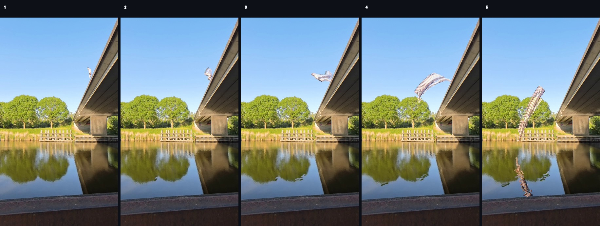
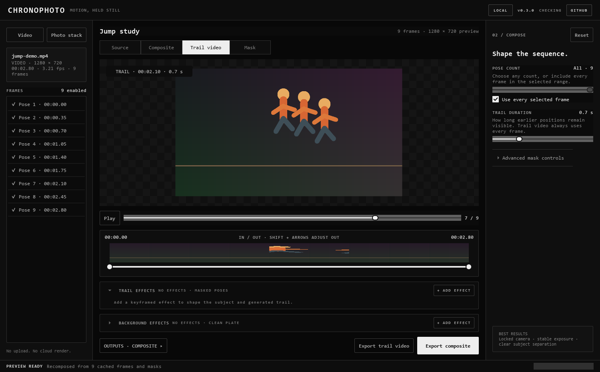
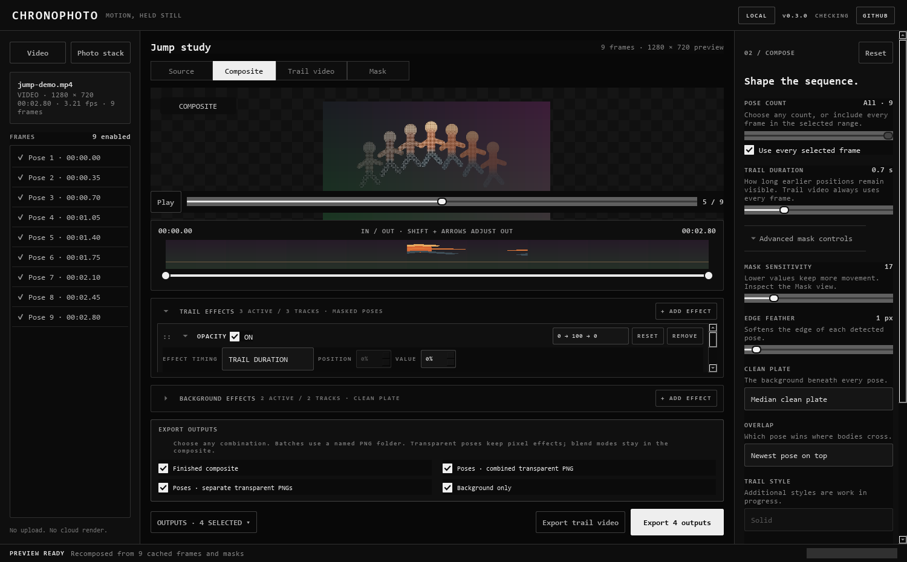
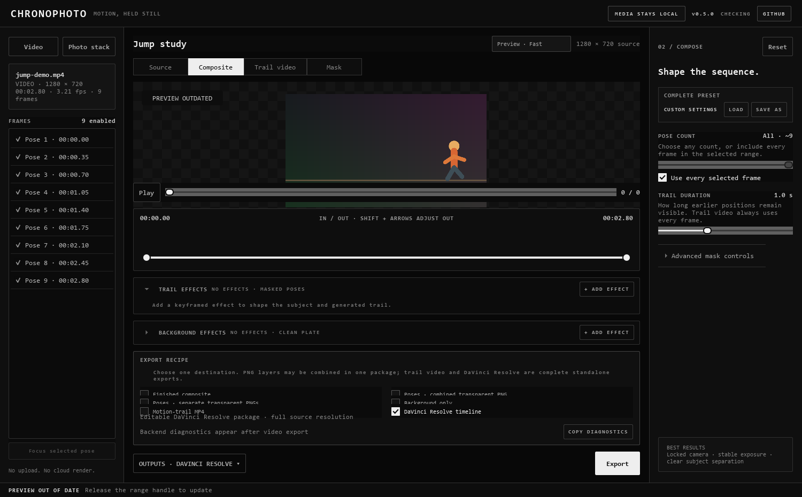
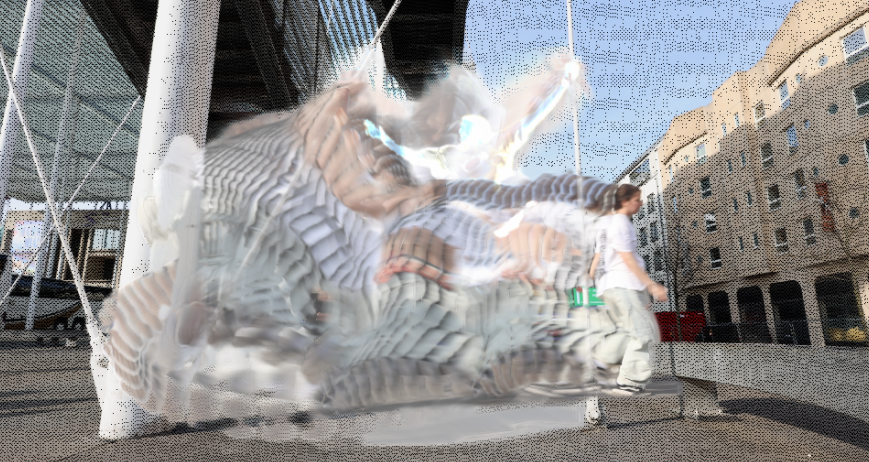

<p align="center">
  
</p>

<h1 align="center">Chronophoto</h1>

<p align="center"><strong>Motion, held still—or carried through time.</strong></p>

<p align="center">
  Turn action footage into layered motion photographs and moving trail videos.<br>
  Video-first. Local processing. Windows, macOS, and Linux.
</p>

<p align="center">
  <a href="https://github.com/m-a-x-s-e-e-l-i-g/chronophoto/releases/latest">
    
  </a>
</p>

<p align="center">
  <a href="docs/videos/motion-trail-bridge-jump.mp4?raw=1">
    
  </a>
</p>

<p align="center">
  <strong>Motion-trail video · 0.7 second trail</strong><br>
  <a href="docs/videos/motion-trail-bridge-jump.mp4?raw=1">Watch the sample MP4 with audio</a>
</p>

## One movement. Two primary outputs.

Chronophoto is a local desktop tool for action photographers and movement
artists. Give it a short video, isolate the useful moment, and choose how time
should appear:

- **Motion-trail video** — the subject moves through the frame while a
  configurable amount of recent movement follows behind.
- **Motion photograph** — the full action becomes one layered still image, with
  distinct poses or a continuous smear.

A jump becomes an arc. A trick keeps its direction and timing. A dance move can
become a photograph, an animation, or a set of editable layers.

> Your media stays on your computer. There is no footage upload or cloud render.
> The optional release update check contacts GitHub without sending media.

## Choose an effect workspace

Chronophoto now opens on an effect library instead of assuming every project is
a Photostack. Each choice has its own source, preview, controls, and export flow:

- **Photostack** keeps the complete motion-photo and motion-trail interface.
- **Silhouette Edge Stretch** detects a subject against the first video frame,
  samples the mask boundary per scanline, and extrudes those edge pixels left,
  right, up, down, or in both directions. Stretch length, mask sensitivity, and
  edge fade are editable with a live preview.
- **Video Volume** loads the complete clip as an **X × Y × Time** volume and
  exposes XY, XT, YT, spatial-diagonal-through-time, and arbitrary
  `t = f(x, y)` surface slices. Time surfaces can be tilted on both spatial axes
  and animated before exporting a still slice.

Close any workspace to return to the effect library and start a different kind
of project.

## Three decisions, then export

### 1. Bring in the action

Drop a video anywhere in the window. An ordered photo stack is also supported
when the action was captured as still photographs.

### 2. Frame the movement

Choose the in and out points around the action. Chronophoto builds a clean plate
and motion masks locally, then keeps them cached while you refine the result.

### 3. Choose how time should look

- Open **Trail video**, choose a duration in seconds, press **Play**, and export
  a full-resolution H.264 MP4 with the selected source audio. The overlap
  setting chooses the single sharp endpoint above each causal trail window.
- Open **Composite**, choose every frame or a smaller pose count, and export a
  PNG, TIFF, JPEG, or editable layer package. Select an enabled frame and turn
  on **Focus selected pose** to place that pose above the chronological stack.
- Open **Export recipe**, select an image/layer combination, **Motion-trail
  MP4**, or **DaVinci Resolve timeline**, then press the single **Export** button.
  Video and Resolve recipes are exclusive; image and layer outputs can be
  combined.



*Source, still composite, trail video, mask inspection, timing, effects, and
the complete export recipe stay in one workspace.*

## Try the complete example

Want to reproduce the result above?

1. Download the included 12-second
   [bridge-jump source video](sample/sample-01.mp4?raw=1) (about 46 MB).
2. Drop it into Chronophoto.
3. Select approximately `00:04.35` to `00:06.65`.
4. Open **Trail video** and set **Trail duration** to `0.7 s`.
5. Press **Play**, select **Motion-trail MP4** in **Export recipe**, then press
   **Export**.

Or [watch the finished sample directly](docs/videos/motion-trail-bridge-jump.mp4?raw=1)
(about 150 KB).

## Main features

### Motion-trail video

- Adjustable trail duration from the current subject only to the complete
  selected range.
- Causal rendering: previous positions can remain visible, but future positions
  never appear early.
- Smooth output from every source frame, independent of the still-image pose
  count.
- Full-resolution H.264 MP4 export with source timing, dimensions, and the
  selected audio re-encoded to AAC.
- Automatic hardware H.264 encoding through Apple VideoToolbox on macOS or
  NVIDIA NVENC when available, with a portable CPU fallback.
- The common renderer streams decoded frames through a bounded trail window;
  trail-relative effects, procedural smears, and backdrop blend modes
  automatically use the compatibility renderer.
- Export diagnostics identify the active decoder, compositor and encoder,
  measured FPS, estimated peak working memory and likely bottleneck. NVENC or
  VideoToolbox encode does not get presented as full GPU rendering.
- Animated in-app preview, export progress, cancellation, and safe cleanup of
  incomplete files.

### Motion photographs and editable layers

- Every selected frame or any smaller number of evenly spaced poses.
- Distinct poses, **Photographic stretch**, or **Dense cloned copies**.
- Newest- or oldest-pose overlap order.
- Full-resolution PNG, TIFF, and JPEG export.
- Finished composite, combined transparent poses, individual pose PNGs, and a
  clean background layer in any combination.
- One-click DaVinci Resolve package with a three-track video timeline,
  processed background, one transparent alpha video, aligned original video,
  synchronized source audio, and round-trip manifest. Per-frame PNG clips are
  retained only as a codec compatibility fallback.

### Creative control

- Separate effect stacks for the detected subject/trail and the clean plate.
- Keyframed opacity, 27 blend modes, saturation, blur, JPEG damage, stippling,
  dithering, and halftone.
- Mask sensitivity, edge feathering, clean-plate selection, and camera
  translation alignment.
- Versioned complete presets that restore composition controls, full ordered
  effect stacks, keyframes, bypass states, and selected outputs.
- Source, composite, trail-video, and mask views with pointer-centred zoom and
  drag-to-pan.

### Local desktop workflow

- No upload, account, cloud render, or external FFmpeg installation.
- Video and mask caching for fast in/out, pose, and effect adjustments.
- Windows, macOS, and Linux release builds.
- Automatic release checks without sending source footage anywhere.

## Motion-trail video

For each output timestamp, Chronophoto combines the current subject with only
the subject positions inside the chosen amount of recent history. When a
position becomes older than the trail duration, it disappears. The trail grows
naturally at the start and the video ends at the selected out point without an
artificial tail-out.

The same mask, overlap, smear, trail-effect, and background-effect settings used
for the still composite also shape the video. Preview playback is sampled to
stay responsive; the final export always processes every source frame.

## Motion photograph and editable layers


The still workflow places the useful stages of an action into one clean image.
Use every frame for a dense motion study, reduce the pose count for clarity, or
disable an individual pose that does not belong.

The default **Export composite** action writes one full-resolution PNG, TIFF, or
JPEG. Open **Outputs** to export any combination of:

- **Finished composite** — the complete Chronophoto image.
- **Poses · combined transparent PNG** — every masked pose on one alpha layer.
- **Poses · separate transparent PNGs** — one numbered PNG per masked pose.
- **Background only** — the processed clean plate without poses.

Combinations and separate-pose batches are collected in a safely named
`-chronophoto-layers` folder. Transparent pose files retain pixel effects;
blend modes remain in the finished composite because a flat transparent image
has no backdrop to blend with.



## DaVinci Resolve timeline export

Open **Export recipe**, choose **DaVinci Resolve timeline**, press **Export**,
and choose the parent folder. Chronophoto creates a new,
non-overwriting `-chronophoto-resolve` package. Import the `.fcpxml` file in
DaVinci Resolve 21 with **File → Import → Timeline**.



```text
jump-chronophoto-resolve/
├── jump.fcpxml
├── manifest.json
└── Media/
    ├── background.png
    ├── original/
    │   └── jump.mp4
    ├── trail/
    │   └── trail-alpha.mov
    └── audio/
        └── source-audio.wav
```

The imported timeline uses the selected source resolution, pixel aspect ratio,
frame rate, in/out duration, and chronological overlap order:

- **V1 — Background** is the processed clean plate for the complete timeline.
- **V2 — Masks / trail** is one timestamped transparent alpha-video clip on one
  video track, rather than hundreds of media-pool assets and timeline clips.
- **V3 — Original video** references the selected source clip at the correct in
  point and starts disabled so it cannot cover the Chronophoto result.
- **A1 — Source audio** is a trimmed PCM WAV synchronized to the selected in
  point. It is omitted when the source has no audio.

Photo-stack exports retain their separate editable pose layout because they do
not have an original video track.

FCPXML media references use URL-escaped absolute `file:///` paths because
DaVinci Resolve leaves relative media URLs offline. The original video is
copied byte-for-byte into `Media/original` without re-encoding, so temporary
source segments and moved originals cannot leave V3 offline. Keep the complete
package in place until the timeline is imported; if it moves first, export
again or relink its `Media` folder in Resolve.
`manifest.json` keeps a relative media inventory and records the source range,
timeline metadata, Chronophoto settings, and mappings that cannot stay
editable. Pixel-local effects are baked into alpha media. Blend modes and
procedural smear styles that FCPXML cannot represent as native Resolve nodes are
recorded as unsupported mappings for the simplified video timeline.

Before a release, import a generated video and photo-stack package in the
documented Resolve version and confirm media is online, alpha edges are clean,
and audio is synchronized.

## Shape the trail and background independently

The workspace separates effects into two scopes:

- **Trail effects** follow the detected subject, sharp poses, photographic
  stretch, and dense cloned copies. Every lane has its own motion keyframes.
- **Background effects** process only the clean plate. These lanes use one
  constant value because the background is a single layer, not a sequence.

Start with `0 → 100 → 0`, `0 → 100`, or `100 → 0`, then drag the keyframes or
enter exact percentages. Each trail-effect lane can use **Full movement** to run
its curve once across the selected clip, or **Trail duration** to reapply it
from the oldest visible trail position to the current subject. This makes it
possible to fade the trail by age while saturation or blend still follows the
complete movement. Full movement remains the default and is also used for still
composites.

Drag lanes to change processing order, stack blend modes, or bypass an effect
without losing its settings. The two editors collapse independently so the
image or video remains the centre of the workspace.


## Save a complete look as a preset

After loading footage, use **Complete preset → Save as** in the composition
inspector. Chronophoto writes a readable, versioned
`.chronophoto-preset.json` file. **Load** restores the complete portable look:

- pose count, every-frame mode, and trail duration;
- mask, clean plate, overlap, smear, alignment, and photo-order controls;
- both ordered effect stacks, including every keyframe, timing basis, blend
  option, amount, and bypass state;
- selected image, layer, or DaVinci Resolve outputs.

The preset name changes to **Modified** as soon as one captured value changes.
Pose count and trail duration clamp to shorter source material and the status
bar reports that adaptation. Source-specific in/out points, enabled frames,
focus pose, and preview quality are intentionally not stored: they belong to
the footage or local performance rather than the reusable look.

## Real-footage examples

The same bridge jump can become a sequence of distinct poses or one continuous
trail. **Smear appearance** controls how Chronophoto fills the movement between
frames. **Overlap** decides whether earlier or later poses remain visible where
the subject crosses itself.

<p align="center">
  
  <br>
  <strong>Full sequence · distinct poses</strong>
</p>

<table>
  <tr>
    <td width="50%" align="center">
      
      <br><strong>Photographic stretch</strong><br><sub>Newest pose on top</sub>
    </td>
    <td width="50%" align="center">
      
      <br><strong>Photographic stretch</strong><br><sub>Oldest pose on top</sub>
    </td>
  </tr>
  <tr>
    <td width="50%" align="center">
      
      <br><strong>Dense cloned copies</strong><br><sub>Newest pose on top</sub>
    </td>
    <td width="50%" align="center">
      
      <br><strong>Dense cloned copies</strong><br><sub>Oldest pose on top</sub>
    </td>
  </tr>
  <tr>
    <td width="50%" align="center">
      
      <br><strong>No smear</strong><br><sub>Oldest pose on top</sub>
    </td>
    <td width="50%" align="center">
      
      <br><strong>Low pose count</strong><br><sub>Fewer distinct moments</sub>
    </td>
  </tr>
</table>

## Fast previews without reopening the video

Chronophoto builds a local frame and mask cache when you open a video. Moving
the in and out points, changing the pose selection, and adjusting the composite
can reuse that work instead of finding every frame again.

The frame list and scrubber stay available while a new preview is being built.
Choose **Preview · Fast**, **Balanced**, **High**, or **Source** in the workspace
header to trade responsiveness for inspection detail. This choice is remembered.
Full-resolution export reads the selected source range again for final quality,
regardless of the preview setting.

## Inspect the edges when you need to

Most of the time, the default mask is enough. Open **Advanced mask controls**
when fine edges, shadows, or overlapping poses need attention. The Mask view
shows exactly which pixels Chronophoto will keep.


*Zoom is anchored beneath the pointer. Double-click the preview to return to a
fitted view.*

## Get creative. Show what you made.

Chronophoto does not have to stop at a clean, literal action sequence. Stack
effects, reverse the overlap, stretch movement, export layers, and combine the
results into something strange and personal.



*Push the trail until the source movement becomes a texture, a rhythm, or an
entirely new composition.*

Made something surprising? Share it in Chronophoto's
[Show and tell discussions](https://github.com/m-a-x-s-e-e-l-i-g/chronophoto/discussions/categories/show-and-tell).
Add a few words about the movement, source footage, effects, or happy accidents
that helped you reach the result. Your experiment might become someone else's
starting point.

[Start a Show and tell post](https://github.com/m-a-x-s-e-e-l-i-g/chronophoto/discussions/new?category=show-and-tell)
or browse the community's creations for inspiration.

## Best results

Chronophoto works best with:

- a locked or very steady camera;
- stable exposure and lighting;
- a short clip focused on one action;
- clear separation between the moving subject and the background.

Moving cameras, large exposure changes, moving foliage, and strong shadows can
require more mask adjustment. Person-aware masking and camera-motion alignment
are planned improvements.

## Download Chronophoto

Published versions are available from
[GitHub Releases](https://github.com/m-a-x-s-e-e-l-i-g/chronophoto/releases).

Release builds include:

- **Windows:** installer and portable ZIP;
- **macOS:** DMG and ZIP for Apple silicon and Intel;
- **Linux:** x86-64 AppImage.

These builds are currently unsigned, so Windows or macOS may show a security
warning. Code signing and macOS notarization are tracked separately.

## Everyday controls

| Action | Control |
| --- | --- |
| Open a video | **Video** or drop the file anywhere |
| Open photographs | **Photo stack** or drop two or more images |
| Choose the action | Drag the **In / Out** handles |
| Inspect a pose | Click a frame or move the pose scrubber |
| Zoom | Pinch or two-finger scroll over the preview |
| Pan | Drag the preview while zoomed |
| Fit the image | Double-click the preview |
| Play sampled frames | **Space** |
| Open a video | **Ctrl+O** |
| Export | **Ctrl+Shift+S** |

---

## Technical notes

Chronophoto is a Python 3.11+ desktop application built with PySide6. PyAV
provides FFmpeg-backed decoding and MP4 encoding, while NumPy and OpenCV handle
frame analysis, masking, alignment, and compositing. Pillow writes the final
image files.
A separate FFmpeg installation is not required.

### Optional NVIDIA GPU acceleration

Chronophoto detects an NVIDIA CUDA GPU automatically. If the optional native
backend is unavailable, the startup banner offers **LEARN MORE**. Windows builds
bundle their own Python 3.12, CUDA runtime, CuPy kernels, and PyNvVideoCodec;
users do not install Python, CUDA, or GPU packages. Supported motion-trail
exports select the backend automatically:

```text
NVDEC device surfaces → CUDA masks/effects/compositor → NVENC device surfaces
```

Decoded NV12 surfaces stay in device memory through fused CUDA masking,
morphology, feathering, rolling alpha composition, color conversion, and NVENC.
The main application only receives progress and the encoded H.264 stream.
Unsupported effects, alignment, odd frame dimensions, runtime failures, or
unsupported hardware choose the existing CPU/NVENC route before rendering (or
retry safely after an unexpected worker failure).

The initial real-hardware qualification uses the 4K `sample-01.mp4` fixture on
a Pascal GTX 1050 Ti. The fused route rendered 30 frames at 19.01 fps versus
2.05 fps for the CPU reference (9.3×). Against the CPU reference image, mean
absolute channel error was 1.597 levels and 98.07% of channel values were within
8 levels. Those tolerances and a minimum 1.2× speedup are encoded as activation
gates. The portable CPU renderer remains supported.

All processing code is kept independent from the Qt interface so future mask
modes can share the same source, cache, preview, and export pipeline.

### Processing model

```text
decode → align → clean plate → masks → effects → composite → encode
```

The render plan models these stages as a typed dependency graph. Materialized
preview artifacts and streaming export artifacts have explicit lifetimes and
cache keys, so a future GPU backend can replace a complete route instead of
adding isolated device calls between CPU copies.

Clean-plate generation uses a temporal median of up to 21 evenly distributed
frames at full source resolution. It works in small row tiles to keep 4K export
memory and CPU-cache usage bounded. Export also avoids retaining every
floating-point mask in memory. The common motion-video path decodes, aligns,
masks, composites and encodes frames incrementally, retaining only clean-plate
samples and the active trail window instead of the complete selected clip.
Long operations can be cancelled without discarding the last successful
preview.

### Run from source

Clone the repository, then use the helper for your platform. It creates the
virtual environment, installs missing dependencies, and starts Chronophoto.

```powershell
git clone https://github.com/m-a-x-s-e-e-l-i-g/chronophoto.git
cd chronophoto
.\run.bat
```

```bash
git clone https://github.com/m-a-x-s-e-e-l-i-g/chronophoto.git
cd chronophoto
bash run.sh
```

On Ubuntu or WSL, install the standard virtual-environment package first if
Python reports that `ensurepip` is unavailable:

```bash
sudo apt install python3-venv
```

Manual setup:

```powershell
python -m venv .venv
.venv\Scripts\Activate.ps1
python -m pip install -e ".[dev]"
chronophoto
```

### Build a desktop package

The build helpers use the same PyInstaller specification as GitHub Actions:

```powershell
.\build.bat
```

```bash
bash build.sh
```

Build output:

| Platform | Output |
| --- | --- |
| Windows | `dist/Chronophoto/Chronophoto.exe` |
| macOS | `dist/Chronophoto.app` |
| Linux | `dist/Chronophoto/Chronophoto` |

The destination computer does not need Python installed.

### Development checks

```powershell
python -m pip install -e ".[dev,build]"
python -m ruff format --check src tests scripts
python -m ruff check src tests scripts
python -m pytest -q
python -m compileall -q src scripts
```

### Automated releases

GitHub Actions runs formatting, linting, compilation, and tests on Windows,
macOS, and Linux. The **Build release** workflow produces all desktop packages
when it is started manually or when a matching version tag is pushed.

```bash
git tag v0.6.0
git push origin v0.6.0
```

The tag must match `project.version` in `pyproject.toml`. Tagged builds publish
the platform packages and SHA-256 checksums to GitHub Releases.

### Refresh documentation and icon assets

The documentation screenshots use a deterministic synthetic sequence, so they
can be regenerated without personal footage:

```powershell
python scripts\capture_readme.py
python scripts\render_motion_video_sample.py
python scripts\generate_icons.py
```

Set `CHRONOPHOTO_ICON_FONT` to override the font used by the icon generator.

### Real-footage validation

Synthetic tests prove the mechanics, not photographic mask quality. Before
treating a mask change as production-ready, validate it with several different
clips:

```powershell
python scripts\validate_clips.py clip1.mp4 clip2.mp4 clip3.mp4 clip4.mp4 clip5.mp4
```

The command writes a composite and mask contact sheet for every clip under
`build/clip-validation/`. Include moving shadows or foliage, exposure changes,
fine hair or spokes, subject overlap, and slight camera motion.

Generate a full Resolve package from the bundled bridge-jump source before the
manual Resolve import smoke test:

```powershell
python scripts\render_resolve_sample.py
```

The package is written under `build/verification/` with one real full-resolution
alpha video, source audio, the aligned original-video reference, FCPXML, and
manifest metadata.

### Current technical boundaries

- Motion-difference masking assumes a mostly static background.
- Inputs are normalized to 8-bit RGB; managed high-bit-depth and HDR workflows
  are not implemented yet.
- Person-aware masking, combined motion/person masks, and layered exports remain
  future work.
- Solid is the current trail renderer; the style selector remains hidden until
  a second functional choice exists.
- Windows builds bundle a qualified NVIDIA decode → CUDA composite → NVENC
  backend for the common solid-trail route. Unsupported settings automatically
  stay on the measured CPU compositor and accelerated-encode path.
- Release automation exists, but production signing and notarization still need
  platform credentials and policy decisions.

## License

Chronophoto is released under the [MIT License](LICENSE).
