<p align="center">
  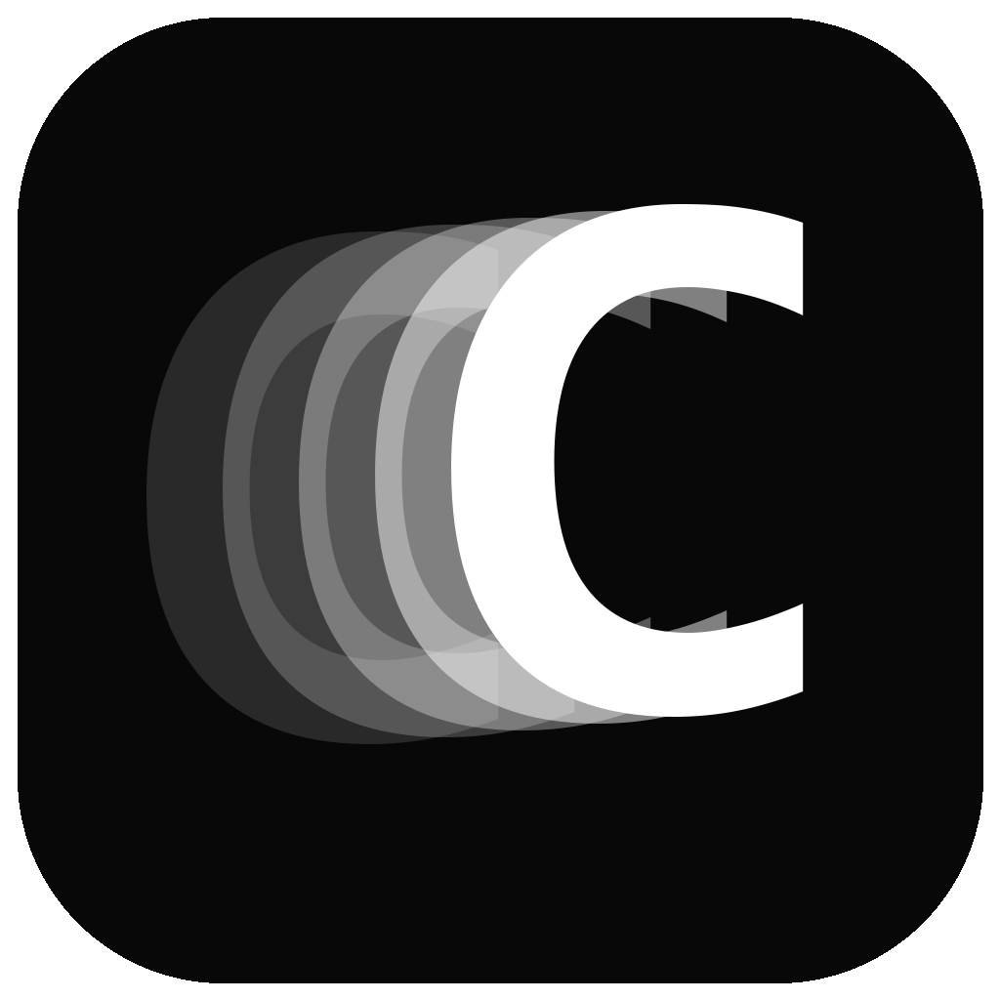
</p>

<h1 align="center">Chronophoto</h1>

<p align="center"><strong>Motion, held still.</strong></p>

<p align="center">
  Turn a short action video into one layered motion photograph.<br>
  Video-first. Local processing. Windows, macOS, and Linux.
</p>

<p align="center">
  <a href="https://github.com/m-a-x-s-e-e-l-i-g/chronophoto/releases/latest">
    
  </a>
</p>

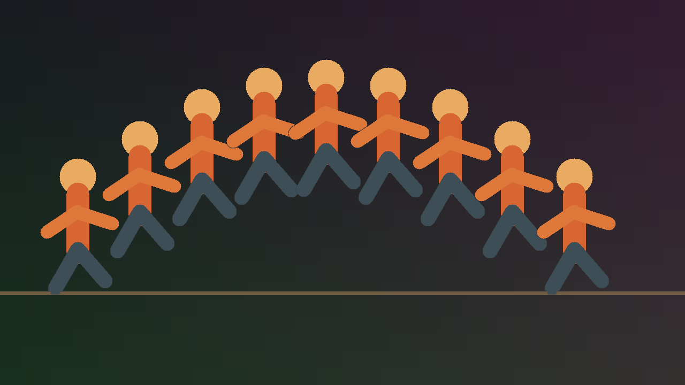

## One movement. One photograph.

Chronophoto takes the useful moment from an action video and places its frames
into a single clean image. A jump becomes an arc. A trick shows its full path.
A dance move becomes a readable sequence.

It is made for parkour, skateboarding, BMX, dance, climbing, athletics, and
any movement that deserves more than one frozen instant.

> Your footage stays on your computer. There is no upload and no cloud render.

## Three decisions, then export

### 1. Bring in the action

Drop a video anywhere in the window. You can also use an ordered photo stack
when the action was shot as still photographs.

### 2. Frame the movement

Choose the in and out points around the action. Chronophoto includes every
selected video frame by default, or you can choose a smaller number of poses.
Disable individual frames when one does not belong in the final sequence.

### 3. Export the photograph

Inspect the composite, make a small mask adjustment only when it needs one,
then export a full-resolution PNG, TIFF, or JPEG.

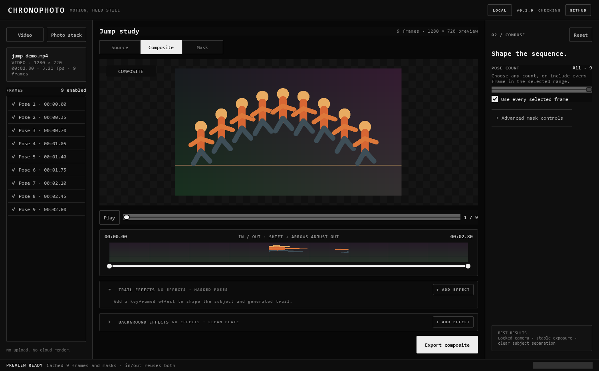

*The main workspace keeps the source frames, composite, timeline, and export
action in one view.*

## Try it with sample footage

Do not have a suitable clip ready? Download the included
[sample video](sample/sample-01.mp4?raw=1) (about 46 MB). It is a 12-second
vertical action clip that you can use to explore Chronophoto without preparing
your own footage first.

1. Download `sample-01.mp4`.
2. Drop it anywhere in the Chronophoto window.
3. Choose a short section with the in and out handles.
4. Leave **Use every selected frame** enabled, inspect the composite, and then
   experiment with the mask and smear controls.

## What you can do

- Open a short video or an ordered stack of photographs.
- Drop footage anywhere in the application window.
- Include every selected frame, or choose any pose count with the slider.
- See the nearest source frame while moving the in and out handles.
- Turn individual poses on or off and reorder photographs.
- Switch between **Source**, **Composite**, and **Mask** views.
- Fine-tune mask sensitivity, edge feathering, clean plate, and overlap order.
- Connect poses with **Photographic stretch** or **Dense cloned copies**, or
  leave smear appearance set to **None** for distinct poses.
- Pinch or two-finger scroll to zoom around the pointer, then drag to pan.
- Apply opacity, Photoshop-style blend modes, saturation, blur, JPEG,
  stippling, dithering, and halftone independently to the trail or background.
- Export full-resolution PNG, TIFF, or JPEG files.
- See whether the installed version is current or a new GitHub release exists.

## Shape the trail and background independently

The workspace separates effects into two clear scopes:

- **Trail effects** follow the detected subject, sharp poses, photographic
  stretch, and dense cloned copies. Every lane has its own motion keyframes.
- **Background effects** process only the clean plate behind the poses. Because
  the clean plate is a single layer rather than a sequence, these lanes use one
  constant value instead of pretend timeline keyframes.

The two editors work like an accordion, keeping one expanded at a time so the
photograph remains the largest part of the workspace. Their stacks are fully
independent and changing either scope reuses the existing frame and mask cache.

Start with `0 → 100 → 0`, `0 → 100`, or `100 → 0`, then drag the keyframes or
enter exact position and value percentages. Effect positions use normalized
motion progress, so the curve survives changes to the in/out range, pose count,
disabled frames, and overlap order.

- **Opacity** fades copies in and out.
- **Blend mode** mixes each pose with the composite beneath it. Choose from 27
  familiar modes including Multiply, Screen, Overlay, Soft Light, Difference,
  Hue, Color, and Luminosity, then keyframe the strength from Normal to the
  selected mode.
- **Saturation** moves between grayscale and the original colour.
- **Blur** uses a configurable maximum radius in output pixels.
- **JPEG quality** runs from visibly damaged at 0% to clean at 100%.
- **Stippling, dithering, and halftone** each have independent intensity curves
  and pattern-size controls.

Drag lanes to change processing order, or bypass one temporarily without losing
its settings. Background opacity fades a processed layer back toward the
untouched clean plate; background blend modes behave like a duplicate clean
plate layer blended over its original.

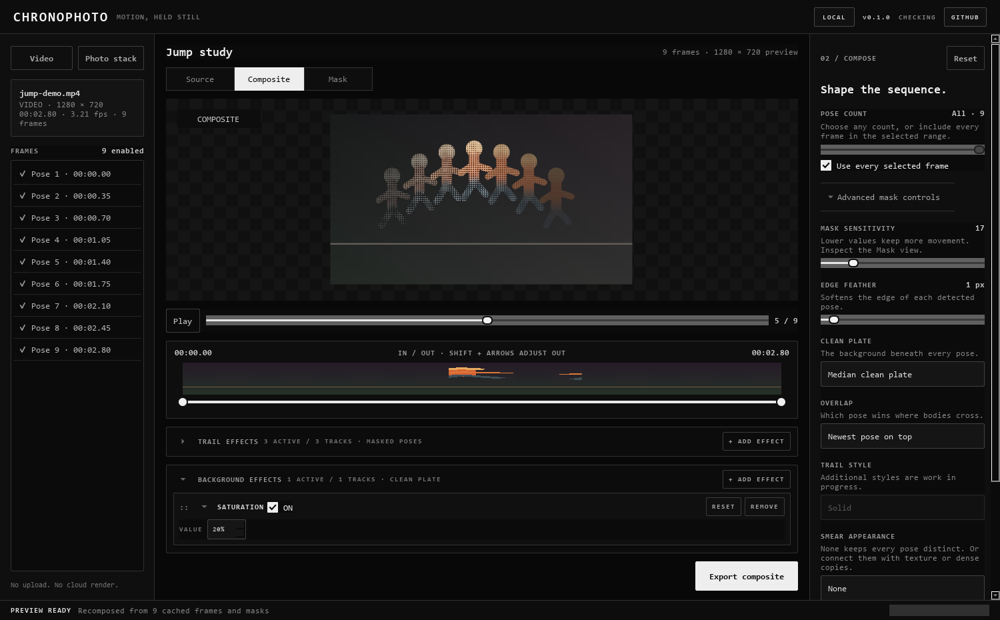

*Trail lanes stay aligned with motion progress; background lanes use one exact
value. The editors collapse independently so the photograph remains the main
workspace.*

## Real-footage examples

The same bridge jump can become a sequence of distinct poses or one continuous
trail. **Smear appearance** controls how Chronophoto fills the movement between
frames. **Overlap** decides whether earlier or later poses remain visible where
the subject crosses itself.

<p align="center">
  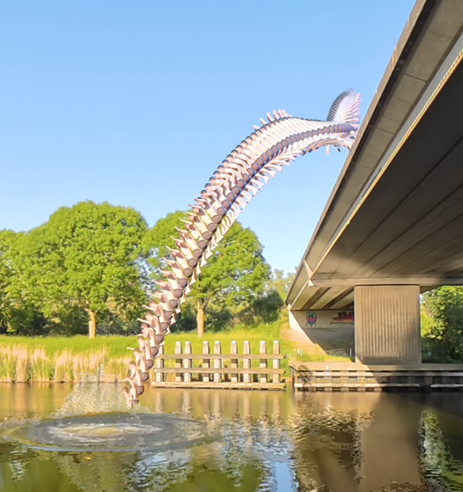
  <br>
  <strong>Full sequence · distinct poses</strong>
</p>

<table>
  <tr>
    <td width="50%" align="center">
      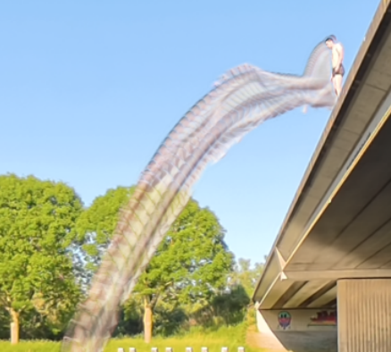
      <br><strong>Photographic stretch</strong><br><sub>Newest pose on top</sub>
    </td>
    <td width="50%" align="center">
      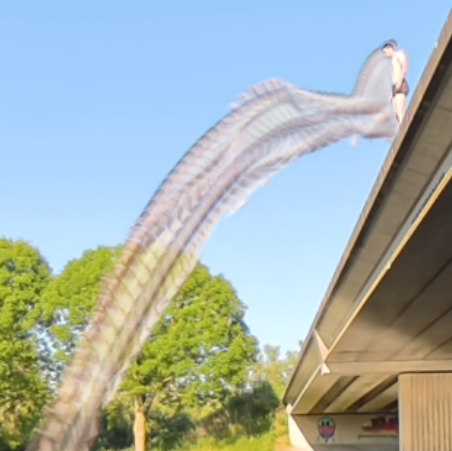
      <br><strong>Photographic stretch</strong><br><sub>Oldest pose on top</sub>
    </td>
  </tr>
  <tr>
    <td width="50%" align="center">
      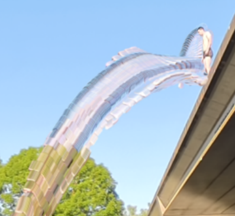
      <br><strong>Dense cloned copies</strong><br><sub>Newest pose on top</sub>
    </td>
    <td width="50%" align="center">
      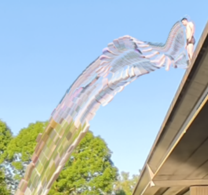
      <br><strong>Dense cloned copies</strong><br><sub>Oldest pose on top</sub>
    </td>
  </tr>
  <tr>
    <td width="50%" align="center">
      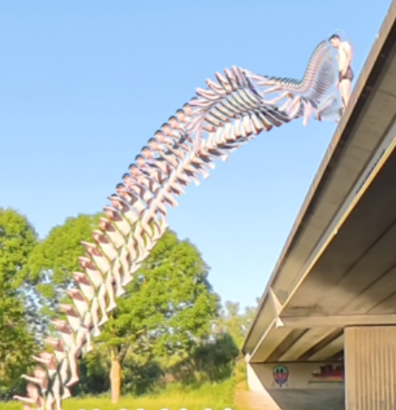
      <br><strong>No smear</strong><br><sub>Oldest pose on top</sub>
    </td>
    <td width="50%" align="center">
      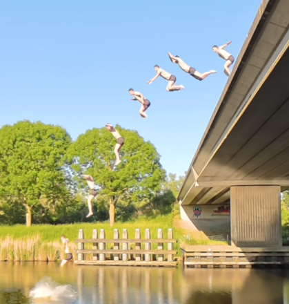
      <br><strong>Low pose count</strong><br><sub>Fewer distinct moments</sub>
    </td>
  </tr>
</table>

## Fast previews without reopening the video

Chronophoto builds a local frame and mask cache when you open a video. Moving
the in and out points, changing the pose selection, and adjusting the composite
can reuse that work instead of finding every frame again.

The frame list and scrubber stay available while a new preview is being built.
Full-resolution export reads the selected source range again for final quality.

## Inspect the edges when you need to

Most of the time, the default mask is enough. Open **Advanced mask controls**
when fine edges, shadows, or overlapping poses need attention. The Mask view
shows exactly which pixels Chronophoto will keep.

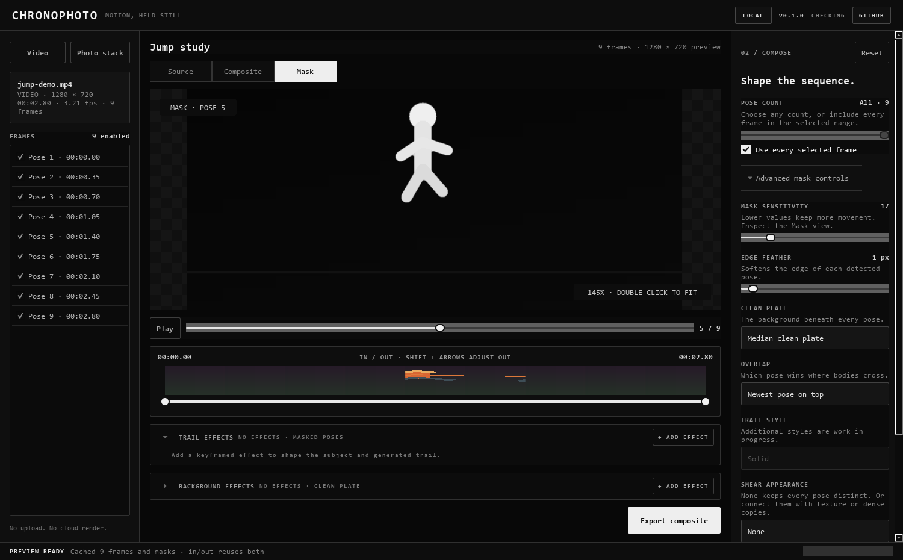

*Zoom is anchored beneath the pointer. Double-click the preview to return to a
fitted view.*

## Show what you made

Created a motion study you like? Share the exported image in Chronophoto's
[Show and tell discussions](https://github.com/m-a-x-s-e-e-l-i-g/chronophoto/discussions/categories/show-and-tell).
Add a few words about the movement, your source footage, or the settings that
helped you get the result.

[Start a Show and tell post](https://github.com/m-a-x-s-e-e-l-i-g/chronophoto/discussions/new?category=show-and-tell)
or browse the community's creations for inspiration.

## Best results

Chronophoto works best with:

- a locked or very steady camera;
- stable exposure and lighting;
- a short clip focused on one action;
- clear separation between the moving subject and the background.

Moving cameras, large exposure changes, moving foliage, and strong shadows can
require more mask adjustment. Person-aware masking and camera-motion alignment
are planned improvements.

## Download Chronophoto

Published versions are available from
[GitHub Releases](https://github.com/m-a-x-s-e-e-l-i-g/chronophoto/releases).

Release builds include:

- **Windows:** installer and portable ZIP;
- **macOS:** DMG and ZIP for Apple silicon and Intel;
- **Linux:** x86-64 AppImage.

These builds are currently unsigned, so Windows or macOS may show a security
warning. Code signing and macOS notarization are tracked separately.

## Everyday controls

| Action | Control |
| --- | --- |
| Open a video | **Video** or drop the file anywhere |
| Open photographs | **Photo stack** or drop two or more images |
| Choose the action | Drag the **In / Out** handles |
| Inspect a pose | Click a frame or move the pose scrubber |
| Zoom | Pinch or two-finger scroll over the preview |
| Pan | Drag the preview while zoomed |
| Fit the image | Double-click the preview |
| Play sampled frames | **Space** |
| Open a video | **Ctrl+O** |
| Export | **Ctrl+Shift+S** |

---

## Technical notes

Chronophoto is a Python 3.11+ desktop application built with PySide6. PyAV
provides FFmpeg-backed decoding, while NumPy and OpenCV handle frame analysis,
masking, alignment, and compositing. Pillow writes the final image files.
A separate FFmpeg installation is not required.

All processing code is kept independent from the Qt interface so future mask
modes can share the same source, cache, preview, and export pipeline.

### Processing model

```text
video (PyAV / FFmpeg) ─┐
                       ├─> ordered RGB frames
photo stack ───────────┘       │
                               ├─> temporal median clean plate
                               ├─> motion masks
                               └─> chronological composite
```

Clean-plate generation uses a temporal median of up to 21 evenly distributed
frames at full source resolution. It works in small row tiles to keep 4K export
memory and CPU-cache usage bounded. Export also avoids retaining every
floating-point mask in memory. Long operations can be cancelled without
discarding the last successful preview.

### Run from source

Clone the repository, then use the helper for your platform. It creates the
virtual environment, installs missing dependencies, and starts Chronophoto.

```powershell
git clone https://github.com/m-a-x-s-e-e-l-i-g/chronophoto.git
cd chronophoto
.\run.bat
```

```bash
git clone https://github.com/m-a-x-s-e-e-l-i-g/chronophoto.git
cd chronophoto
bash run.sh
```

Manual setup:

```powershell
python -m venv .venv
.venv\Scripts\Activate.ps1
python -m pip install -e ".[dev]"
chronophoto
```

### Build a desktop package

The build helpers use the same PyInstaller specification as GitHub Actions:

```powershell
.\build.bat
```

```bash
bash build.sh
```

Build output:

| Platform | Output |
| --- | --- |
| Windows | `dist/Chronophoto/Chronophoto.exe` |
| macOS | `dist/Chronophoto.app` |
| Linux | `dist/Chronophoto/Chronophoto` |

The destination computer does not need Python installed.

### Development checks

```powershell
python -m pip install -e ".[dev,build]"
python -m ruff format --check src tests scripts
python -m ruff check src tests scripts
python -m pytest -q
python -m compileall -q src scripts
```

### Automated releases

GitHub Actions runs formatting, linting, compilation, and tests on Windows,
macOS, and Linux. The **Build release** workflow produces all desktop packages
when it is started manually or when a matching version tag is pushed.

```bash
git tag v0.1.0
git push origin v0.1.0
```

The tag must match `project.version` in `pyproject.toml`. Tagged builds publish
the platform packages and SHA-256 checksums to GitHub Releases.

### Refresh documentation and icon assets

The documentation screenshots use a deterministic synthetic sequence, so they
can be regenerated without personal footage:

```powershell
python scripts\capture_readme.py
python scripts\generate_icons.py
```

Set `CHRONOPHOTO_ICON_FONT` to override the font used by the icon generator.

### Real-footage validation

Synthetic tests prove the mechanics, not photographic mask quality. Before
treating a mask change as production-ready, validate it with several different
clips:

```powershell
python scripts\validate_clips.py clip1.mp4 clip2.mp4 clip3.mp4 clip4.mp4 clip5.mp4
```

The command writes a composite and mask contact sheet for every clip under
`build/clip-validation/`. Include moving shadows or foliage, exposure changes,
fine hair or spokes, subject overlap, and slight camera motion.

### Current technical boundaries

- Motion-difference masking assumes a mostly static background.
- Inputs are normalized to 8-bit RGB; managed high-bit-depth and HDR workflows
  are not implemented yet.
- Person-aware masking, combined motion/person masks, and layered exports remain
  future work.
- Trail style currently stays on **Solid** while additional styles are developed.
- Release automation exists, but production signing and notarization still need
  platform credentials and policy decisions.

## License

Chronophoto is released under the [MIT License](LICENSE).
